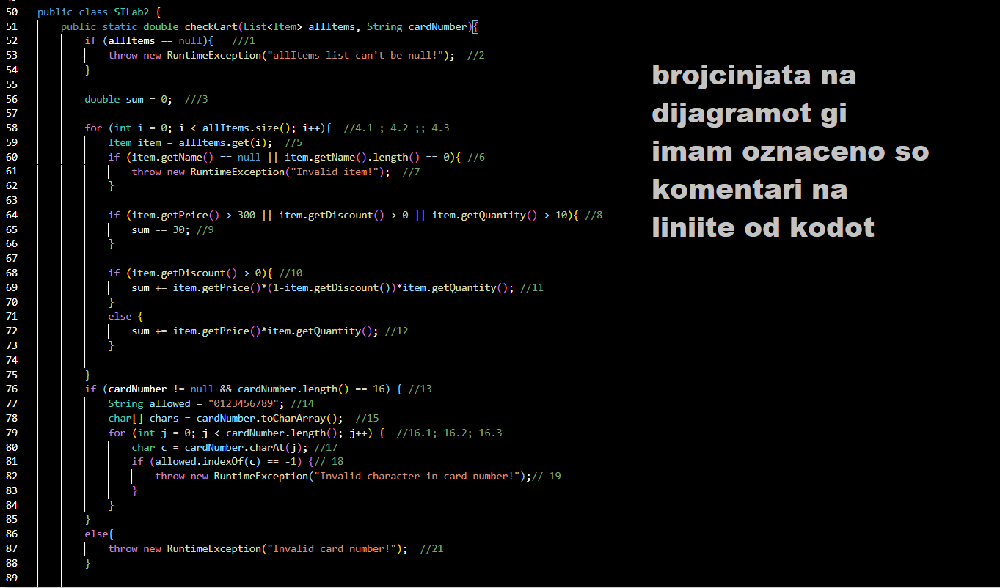

# SI_2025_lab2_233013

Втора лабараториска вежба по Софтверско инженерство

Тамара Мурџоска, бр. на индекс 233013

Control Flow Graph

Цикломатска комплексност

Цикломатската комплексност на овој код е 9, истата ја добив преку формулата P+1. Во овој код имаме 6 if услови, и 2 for циклуси. Според формулата добиваме 8+1 = 9.

Every statement

Тест 1:allitems==null card number=1234567812345678

Teст 2:allitems = [item(name = "", qunatity=4, price = 100, discount = 0 )] card number = 1234567812345678

Тест 3:allitems = [item(name = "item", qunatity=40, price = 400, discount = 0.5 )] card number = 123456781234567812344

Тест 4:allitems = [item(name = "item", qunatity=40, price = 400, discount = 0 )] card number = 12vfeg3456yt6123

Тест 5:allitems = [item(name = "item", qunatity=40, price = 400, discount = 0 )] card number = 1234567812345678

